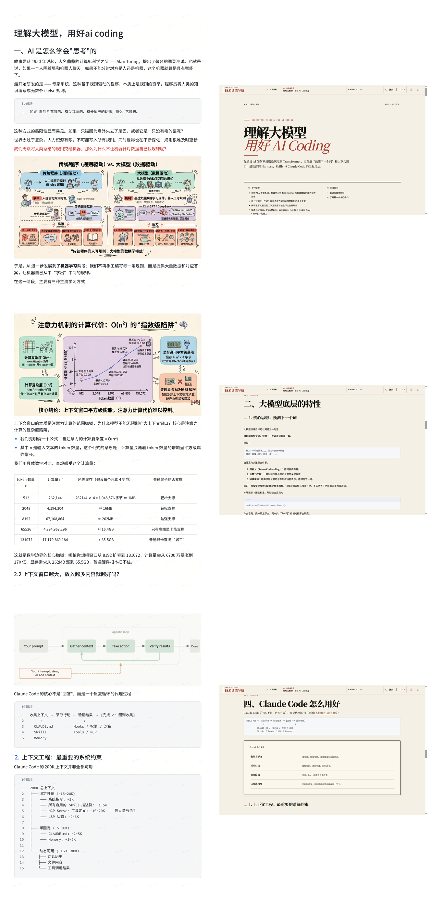
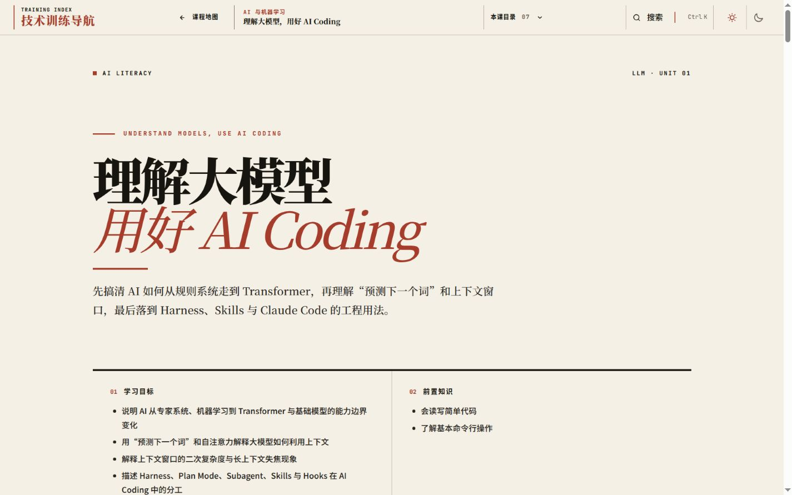
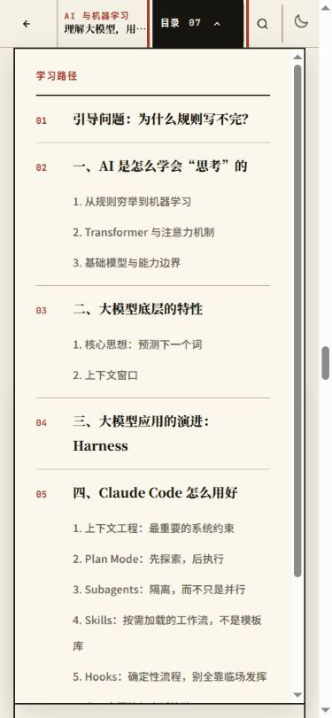
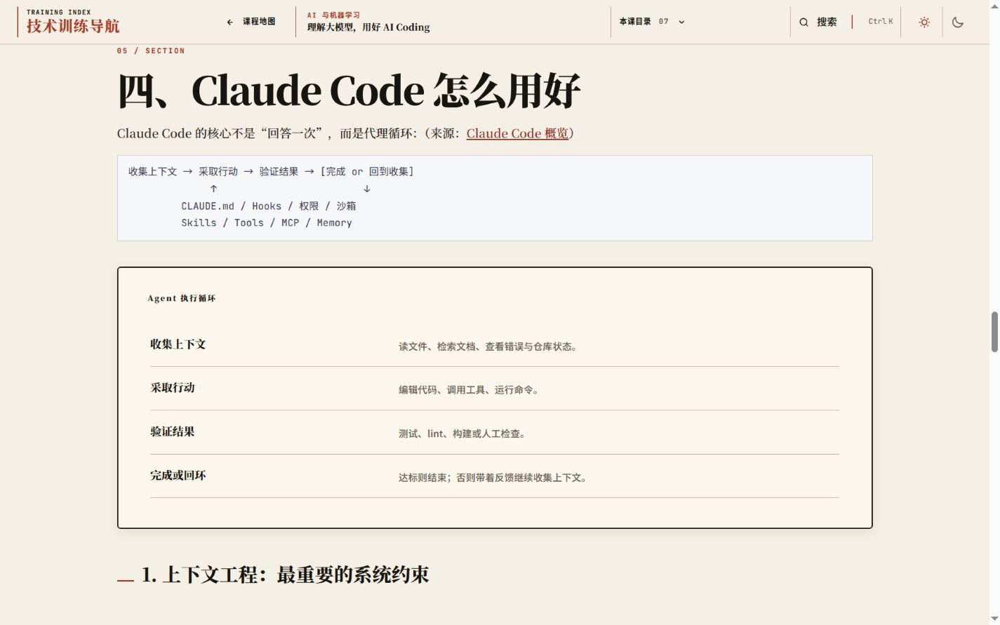
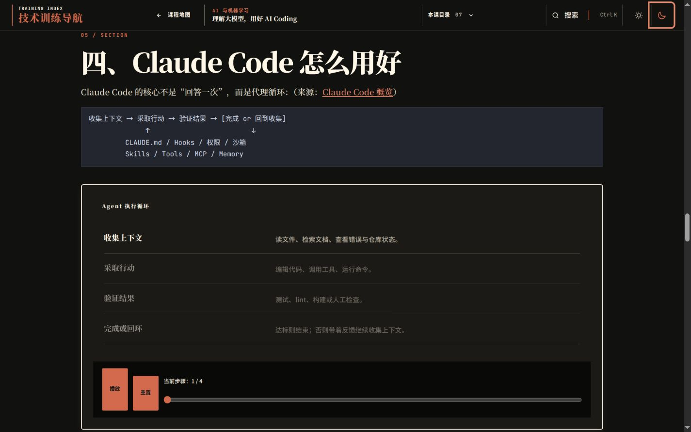
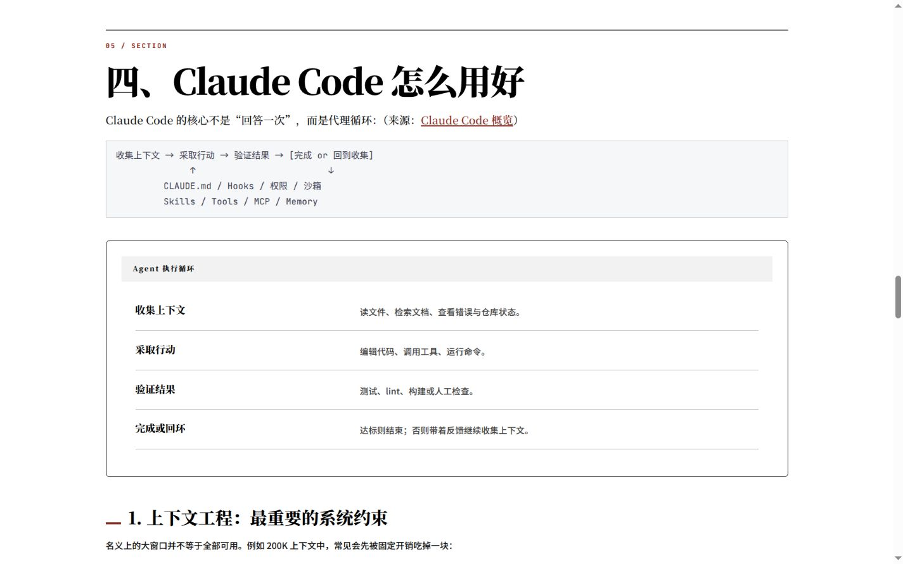

# AI 通识培训页多维审计报告

- 审计对象：http://localhost:4321/lessons/ai-literacy/
- 参考材料：[《理解大模型，用好 AI》](</data/Notes/AI/理解大模型，用好ai.pdf>)
- 审计日期：2026-07-21
- 审计范围：内容覆盖、教学设计、事实证据、视觉设计、交互、响应式、无障碍、降级能力、打印、构建与 QA

## 结论

这是一个 6.8/10 的可用内测版。视觉系统、响应式和降级能力成熟；教学转译、事实证据和 QA 门禁需要重点迭代。当前成果适合作为下一轮 skill 的回归样本。进入质量标杆库前，应完成本文列出的 P0 项。

## 评分

| 维度 | 评分 | 判断 |
| --- | ---: | --- |
| PDF 内容覆盖 | 7.5 | 四个主章节、主要观点和 Claude Code 实践均已覆盖，具体案例与图示被大量压缩 |
| 教学设计 | 6.0 | 目标、前置知识、练习、回顾齐全，100 分钟承载的概念密度过高 |
| 事实与证据 | 5.0 | manifest 结构完整，关键主张存在来源错配、缺失和时效问题 |
| 视觉设计 | 8.5 | 编辑出版风格稳定，层级、留白、字体和主题一致 |
| 交互价值 | 7.0 | 时间线交互清晰且键盘可用，交互预算没有投向最难理解的注意力与上下文机制 |
| 响应式与无障碍 | 7.5 | 移动端、语义结构、目录键盘操作表现良好，时间线非当前文本对比度不达标 |
| 降级与打印 | 9.0 | 减少动态、无 JavaScript、打印模式均保留完整内容 |
| QA 与可复现性 | 3.0 | 构建通过，现有 QA 报告严重过时，新增专题缺少浏览器证据 |

## 审计方法

本次检查执行了以下工作：

1. 提取并阅读 15 页参考 PDF 的正文。
2. 渲染 PDF 页面并检查版式、图表、代码和内容层级。
3. 在桌面浅色、桌面深色和 390×844 手机视口检查网页。
4. 测试课程目录、时间线播放、重置、Range 键盘操作和 Esc 关闭。
5. 检查减少动态、无 JavaScript 和打印媒介。
6. 检查标题语义、页内链接、页面级横向溢出和控制台日志。
7. 运行内容验证、Astro 类型检查、生产构建和下一词演示。
8. 对照 manifest、catalog、qa-report、browser-report 和验证脚本。
9. 核验 Claude Code、MCP、Plan Mode、Subagent 和 Agent Skills 的当前官方文档。

## 做得好的部分

### 桌面刊头和阅读入口清晰

刊头具有明确识别度。学习目标和前置知识在首屏形成稳定入口。页面使用暖白背景、墨色正文、低饱和红色强调和衬线标题，符合站点既有编辑出版风格。

### PDF 被转成语义 HTML

页面具有唯一 h1、分级标题、表格 caption、来源列表和原生课程目录。44 个页内链接均能找到目标。

参考 PDF 的 Tagged 属性为 no。网页补充了 PDF 缺失的语义结构，提升了屏幕阅读器和键盘用户的使用基础。

### 移动端布局稳定

390×844 视口下，页面内容宽度和 scrollWidth 均为 375px。代码块在容器内部滚动，页面主体没有横向溢出。

课程目录支持键盘聚焦和 Esc 关闭。菜单打开后提供章节层级和滚动区域。

### 交互具有完整降级

两个时间线都提供服务端静态终态。正常模式支持播放、重置、Range 方向键、Home 和 End。减少动态与无脚本模式展示全部步骤，打印模式隐藏导航与控制按钮。

### 构建和示例可运行

以下检查通过：

- npm run validate
- npm run check
- npm run build
- node examples/next-token-demo.mjs

Astro 检查结果为 0 errors、0 warnings、0 hints。生产构建生成 6 个专题页和 17 个静态页面。

### 部分工程内容符合当前官方文档

Plan Mode 的只读探索描述符合当前 [Claude Code 权限模式文档](https://code.claude.com/docs/en/permission-modes)。

Subagent 的独立上下文、tools、disallowedTools、model、maxTurns 和 isolation: worktree 等配置符合当前 [Claude Code Subagent 文档](https://code.claude.com/docs/en/sub-agents)。

## 主要问题

### P0：事实与证据门禁失效

[ai-literacy.mdx](../../../src/content/docs/lessons/ai-literacy.mdx) 第 228 至 249 行沿用了 PDF 中“多个 MCP Server 会固定占用大量工具定义”的判断。

当前 Claude Code 默认启用 Tool Search。启动时加载工具名称和服务端说明，具体工具定义按需进入上下文。页面使用的固定开销模型已经过时。依据见 [Claude Code MCP 官方文档](https://code.claude.com/docs/en/mcp)。

[ai-literacy.json](../../../src/data/lessons/ai-literacy.json) 的证据结构还存在以下问题：

- “当代大语言模型以预测下一 token 为核心训练目标”只绑定 Transformer 翻译论文，支持范围偏窄。
- 长上下文中部失效、基础模型涌现能力和具体上下文开销缺少对应 claim。
- MCP 来源是协议介绍页，无法支持 Claude Code 的上下文加载行为。
- researchStatus 被设置为 complete，实际主张覆盖仍有缺口。

长上下文中部利用率下降可以绑定专门的 [Lost in the Middle 论文](https://arxiv.org/abs/2307.03172)。下一词预测应补充专门讨论自回归语言模型训练目标的来源。

### P0：QA 报告与当前站点冲突

[qa-report.json](../../../qa-report.json) 第 6 行写着 AI 专题已经删除。[browser-report.json](../../browser-report.json) 第 21、23、30 行写着当前没有 completed 专题和专题交互。

当前 catalog、构建和浏览器均确认 ai-literacy 已完成。浏览器报告只覆盖首页和分类页，没有覆盖 /lessons/ai-literacy/。

[validate-content.mjs](../../../scripts/validate-content.mjs) 第 744 至 767 行只检查报告字段、状态和证据文件是否存在。浏览器结果过期时只产生 advisory。第 795 至 797 行明确允许 npm run verify 继续执行。

Skill 已经要求浏览器验证和 QA 报告。当前缺口来自执行约束缺少机械门禁。增加自然语言要求的收益有限，验证器需要识别过期证据并使任务失败。

### P1：PDF 中的教学图示几乎全部丢失

浏览器资源清单显示当前页面没有图片资源。PDF 中承担教学作用的内容包括：

- 规则程序与数据驱动模型对照。
- 训练数据、网络和生成能力关系。
- 注意力复杂度曲线与显存示意。
- AI Engineering 三阶段。
- Harness 架构图。
- Agent 循环、上下文预算图和 Hooks 截图。

网页将其中多数内容压成表格、代码块或段落。最需要视觉解释的注意力、长上下文失焦和上下文预算仍采用纯文字。两处时间线主要呈现历史顺序和代理循环。

Skill 需要增加参考资产处理表。每个图表记录保留、转译、压缩或删除，以及对应理由。承担机制解释的图应复用用户提供的原始资产，或转成带 alt、caption 和静态降级的原生图示。

### P1：课程负荷与考核闭环不足

课程有 5 个学习目标、13 个二级标题、23 个三级标题和 68 个段落。页面高度约 13,133px，相当于 18 个桌面视口。

100 分钟内同时讲解机器学习、Transformer、上下文窗口、Harness 和六类 Claude Code 工程能力，学习目标跨度较大。

[ai-literacy.mdx](../../../src/content/docs/lessons/ai-literacy.mdx) 第 370 至 375 行提供了四个练习。这些练习缺少参考结果、评分标准、目标映射和补救路径。

建议拆成三个模块：

1. 模型机制：规则、机器学习、Transformer、下一词预测。
2. 上下文工程：窗口成本、失焦、上下文管理。
3. Agent 工程：Harness、Plan、Subagent、Skills、Hooks。

每个模块应记录预计时长、核心内容、拓展内容、形成性检查和验收产物。

### P1：交互状态对比度不达标

[components.css](../../../src/styles/components.css) 第 421 行将非当前时间线步骤设置为 opacity: 0.5。

实测正文最终对比度如下：

- 浅色主题约 2.06:1。
- 深色主题约 2.96:1。

普通文本目标为 4.5:1。当前颜色门禁只检查 token，没有计算透明度叠加后的最终颜色。

Skill 的视觉门禁应覆盖 hover、focus、inactive、disabled 和 data-active 等真实组件状态。

### P1：交互预算投向了较低难度的知识关系

能力演进时间线和 Agent 执行循环能够帮助读者观察顺序。注意力机制、O(n²) 成本、长上下文位置偏差和上下文预算具有更高的理解成本。

建议将主要交互用于以下关系：

- token 数量变化如何影响注意力矩阵规模。
- 关键信息位于开头、中间和结尾时的利用差异。
- 系统指令、技能、工具、文件和历史如何共同消耗上下文。
- Harness 中的约束、行动、验证和记忆如何形成反馈循环。

### P2：文案存在重复的否定式对比

[ai-literacy.mdx](../../../src/content/docs/lessons/ai-literacy.mdx) 第 212、260、279、357 行反复使用否定式对比标题或句式。文案更接近演讲提纲，定义精度下降。

Skill 可以增加中文文案 lint，检查以下内容：

- 假设读者存在某种误解后再纠正。
- 删除后不损失信息的修饰。
- 缺少技术定义的比喻。
- 重复的情绪性强调。

## Skill 迭代建议

### 1. 增加 reference-artifact.json

记录参考材料的结构：

- 文件路径、标题、类型、页数和使用权限。
- 章节目录。
- 图表、截图、代码块、表格和案例。
- 每个资产承担的教学作用。
- 需要事实核验的主张。

### 2. 增加 coverage-matrix.json

每个参考内容记录：

- 来源页码或章节。
- 对应学习目标。
- 网页中的落点。
- 处理方式：保留、转译、压缩、删除。
- 处理理由。

删除承担教学作用的图示时，门禁应失败。

### 3. 增加 objective-assessment-map

每个学习目标绑定以下项目：

- 正式讲解。
- 例子或演示。
- 练习。
- 评分标准。
- 反馈与补救路径。

### 4. 强化 claim-coverage

researchStatus: complete 应满足以下条件：

- 所有关键主张具有 claim ID。
- claim 绑定适用范围一致的来源。
- MDX 主张能够反向定位 manifest 来源。
- 产品、版本、命令和配置使用当前官方文档。
- 用户提供的讲义只承担课程结构和案例输入职责，事实仍需独立核验。

### 5. 增加 QA 新鲜度检查

QA 报告需要记录：

- reviewedLessonIds。
- 专题正文哈希。
- manifest 哈希。
- 浏览器目标路径。
- 视口、主题、JavaScript、动态和打印状态。
- 截图路径与生成时间。

新增或修改 completed 专题时，browser-report.pages 必须包含对应课程路径。报告哈希与当前文件不一致时，验证器应失败。

### 6. 检查最终状态对比度

颜色检查需要合成以下因素：

- 文本颜色。
- 元素 opacity。
- 父级 opacity。
- 背景色。
- 主题。
- hover、focus、active、inactive 和 disabled 状态。

### 7. 增加课程时长分配

lesson plan 可以增加 segments：

| 字段 | 作用 |
| --- | --- |
| title | 模块名称 |
| minutes | 预计时长 |
| objectiveIds | 对应目标 |
| required | 核心或拓展 |
| assessmentId | 对应检查 |

门禁检查模块总时长、目标覆盖和评估覆盖。

### 8. 增加性能趋势记录

当前页面通过 React 与 GSAP 实现两个时间线和两个滚动揭示。生产构建中，与这些岛组件相关的共享 JavaScript gzip 体积约 89KB，公共 CSS gzip 体积约 339KB。

Skill 应记录每次新增专题带来的资源增量，并对以下情况给出提示：

- 简单交互引入新的框架运行时。
- 页面没有图片，CSS 与字体资源仍持续增长。
- 多个组件重复加载相同依赖。

## 浏览器检查结果

| 步骤 | 状态 | 结果 |
| ---: | --- | --- |
| 1 | 参考 PDF 健康 | 内容完整，语义标签缺失 |
| 2 | 桌面浅色首屏健康 | 刊头、目标和前置知识清晰 |
| 3 | 模型机制章节需改进 | 内容完整，视觉教学密度偏低 |
| 4 | Agent 时间线部分健康 | 播放和键盘交互正常，非当前文本对比度失败 |
| 5 | 手机首屏与目录健康 | 无页面级横向溢出，Esc 关闭正常 |
| 6 | 减少动态与无脚本健康 | 全部步骤和正文保持可读 |
| 7 | 打印样式健康 | 导航和交互控件隐藏，正文保留 |
| 8 | 构建健康 | validate、check、build 和示例运行通过 |
| 9 | QA 报告失败 | 报告内容与当前 catalog 和构建冲突 |

## 审计限制

本次检查没有执行真实屏幕阅读器朗读、实际纸张分页、生产网络环境性能测试和完整 WCAG 自动化扫描。无障碍结论覆盖 DOM 语义、键盘行为、可见状态、响应式和计算后的文本对比度。

## 建议执行顺序

1. 将 QA 新鲜度、逐条证据覆盖和参考资产映射做成失败即退出的门禁。
2. 更新 MCP 上下文相关内容和来源。
3. 修复时间线非当前文本对比度。
4. 为注意力、长上下文和上下文预算增加解释性图示或交互。
5. 拆分课程模块并补充目标到考核的映射。
6. 使用同一 PDF 重新生成页面，运行完整浏览器矩阵并对照本报告。

当前页面应保留为回归 fixture。下一轮 skill 迭代以本报告中的 P0 项作为验收条件。
